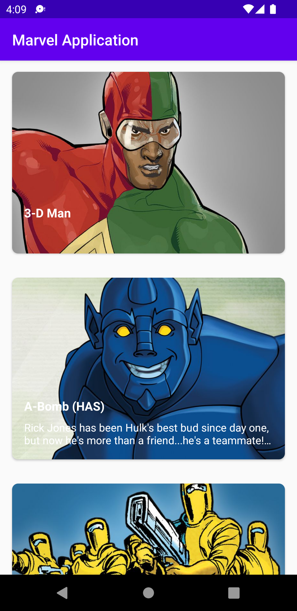
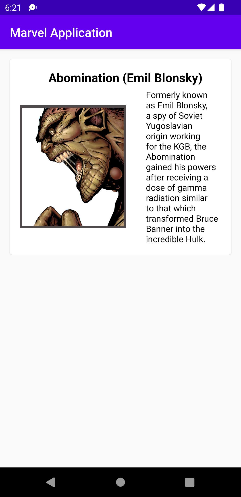

# Marvel App

This project is a sample app created to show Marvel Api implementation using Android Clean
Architecture

## Libraries and Tools Used

- Kotlin
- AndroidX
    - App Compat
    - RecyclerView
- Material Components
- Android Architecture Components
    - Lifecycle and ViewModel
- Retrofit
- Glide
- Kotlin Coroutines
- Hilt
- Navigation Component
- Data Binding
- JUnit and Mockito

## Project Structure

This project is built using Clean Architecture and is structured in the following way:

**presentation** - contains Activities/Fragments and their corresponding ViewModels and Adapters for
the presentation layer

**domain** - contains model and use cases for the presentation layer to access data from the **
data** layer

**data** - contains entities, source, mapper and repositories implementation for getting data

## Marvel API

The API keys should be in a **api.properties** in the root folder and will be loaded into the app
as **BuildConfig** fields.

You can create your own API keys
on [Marvel's developer site] (https://developer.marvel.com/documentation/getting_started)

## Screenshots

